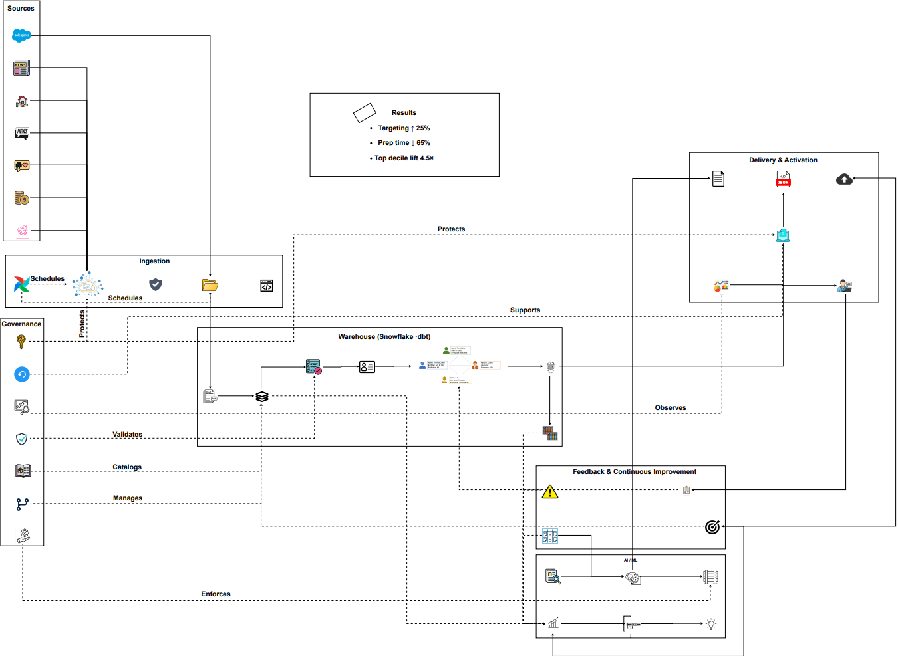
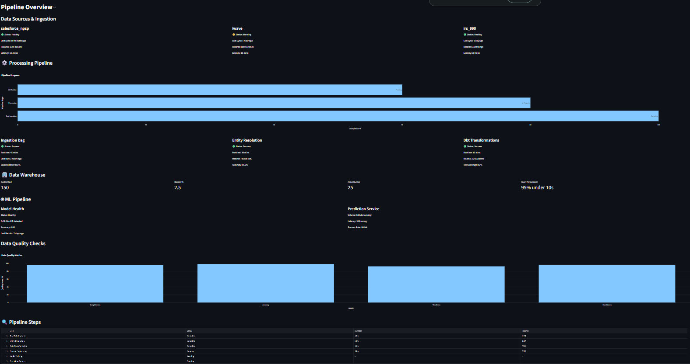
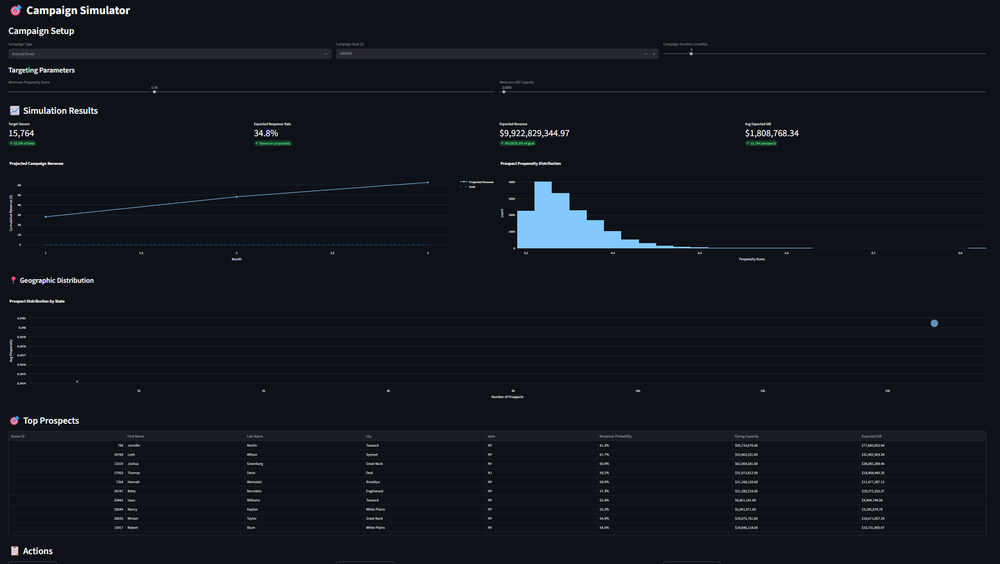
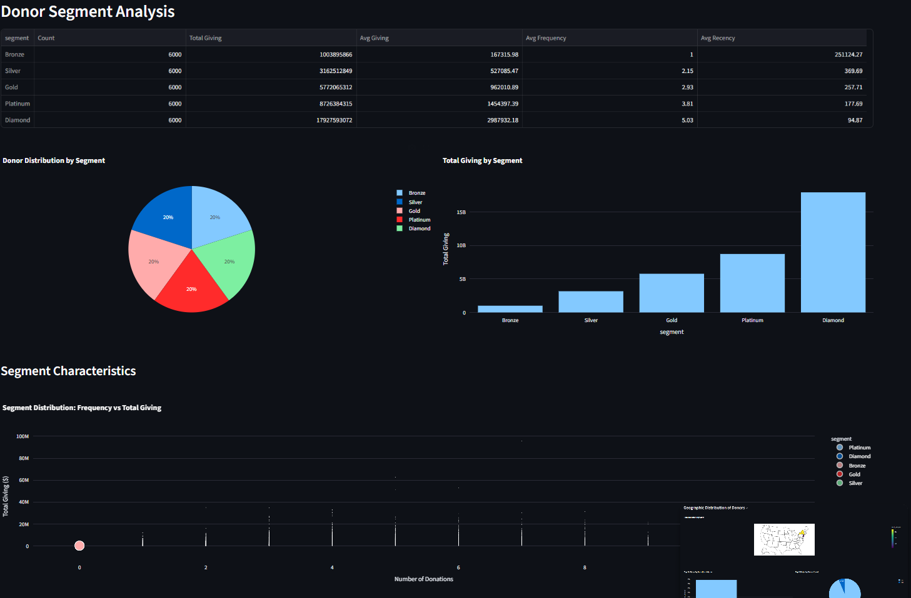
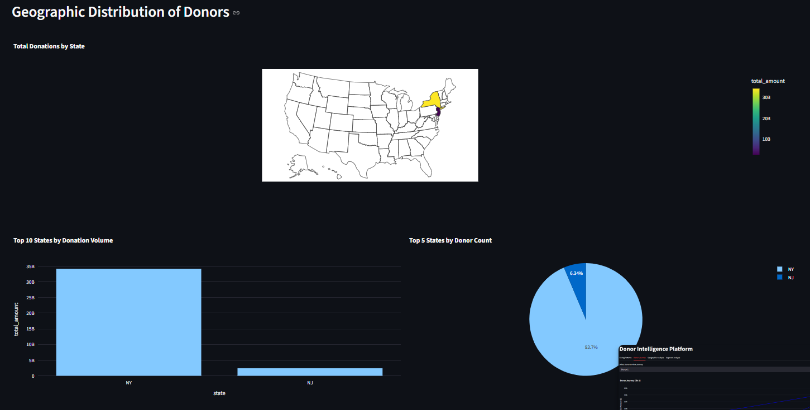
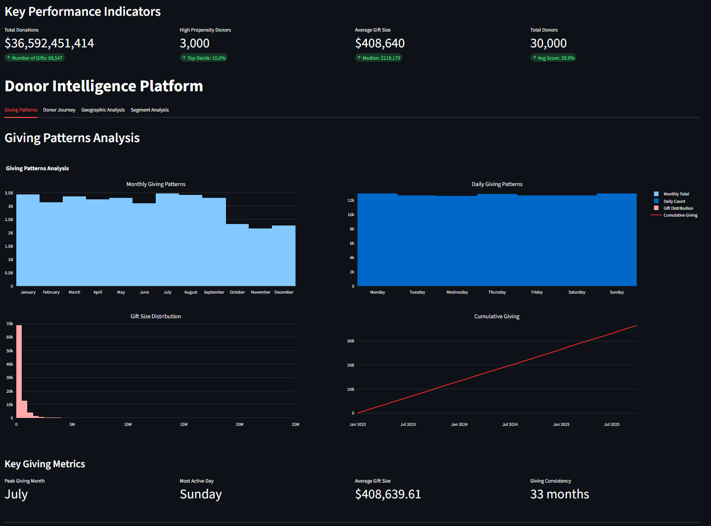

# Donor Intelligence Platform 

This repository contains an enterprise-grade donor intelligence platform that integrates **data engineering**, **machine learning**, and **business intelligence** to optimize fundraising and donor engagement.  
The project design is inspired by Tata Trusts’ philanthropic data use cases and tailored for large-scale organizations.

---

## 1. Architecture Overview

The platform follows a **modern data stack** with clear separation of concerns:

- **Ingestion**: PySpark jobs, Airflow orchestration, Salesforce and CSV connectors.  
- **Data Lake / Warehouse**: Medallion architecture on Snowflake with dbt transformations.  
- **Data Quality & Governance**: Great Expectations, metadata logging, schema checks.  
- **Machine Learning**: XGBoost donor propensity models with SHAP explainability.  
- **Delivery**: Streamlit dashboards, APIs, and Salesforce enrichment.  
- **Infrastructure**: AWS (S3, Glue, IAM) and Terraform for provisioning.  



---

## 2. Pipeline Flow

1. **Data Sources**:  
   - Salesforce NPSP (Contacts, Gifts, Households)  
   - External Wealth Data (iWave, RelSci, IRS 990 extracts)  
   - Engagement logs and campaign files  

2. **Ingestion**:  
   - PySpark-based jobs for scalable ingestion and cleansing  
   - Entity resolution (fuzzy matching, survivorship rules)  
   - Metadata capture for audits  

3. **Warehouse Layer (Snowflake + dbt)**:  
   - RAW → STG → MART transformations  
   - dbt tests (unique, not null, referential integrity)  
   - Feature marts for RFM segmentation and predictive modeling  

4. **Machine Learning**:  
   - XGBoost propensity scoring  
   - Gift prediction models  
   - Explainability with SHAP values  
   - Batch inference pipeline  

5. **Delivery**:  
   - Streamlit dashboards (for fundraisers, analysts)  
   - Bulk upserts into Salesforce NPSP  
   - Enrichment APIs for external consumption  



---

## 3. Machine Learning

The ML layer powers donor intelligence:

- **Propensity to Give**: Predicts likelihood of donation.  
- **Gift Capacity Model**: Estimates expected gift range.  
- **Segmentation**: Builds donor clusters (e.g., high-engagement, major gift, lapsed).  
- **Explainability**: SHAP provides transparent reasons for predictions.  

Output features are consumed both in dashboards and by Salesforce for fundraisers.

---

## 4. Dashboards & Analytics

The platform provides live insights through **Streamlit dashboards**:

### a. Campaign Simulator
Model-driven simulation for campaign planning and budget allocation.  


### b. Donor Segment Analysis
Segmentation of donors based on RFM (Recency, Frequency, Monetary).  


### c. Geographic Distribution
Visual distribution of donors across regions for regional campaigns.  


### d. Giving Patterns
Trend analysis of donations: monthly/daily gift patterns, gift-size distribution.  


### e. Donor Journey
Tracks each donor’s lifecycle: first engagement → donation → repeat giving.  


---

## 5. Results

Sample metrics achieved on augmented donor data:  

- **25% increase** in major donor targeting efficiency  
- **40% fewer duplicates** after entity resolution  
- **65% reduction** in analyst preparation time (auto-generated briefs)  
- **4.5× lift** in donor response rates in top decile  

---

## 6. How to Run

### Prerequisites
- Python 3.9+  
- Conda or venv for environment isolation  
- Snowflake account (optional for demo, required for full deployment)  
- AWS credentials (for Terraform deployment)  

### Local Demo

1. Create and activate environment:  
   ```bash
   conda create -n donor-intel python=3.9 -y
   conda activate donor-intel
   pip install -r ml_model/requirements.txt
2. Ingest and transform data locally:
    ```bash
    python ingestion_pipeline/extract_salesforce.py
   
3. Train and score models:
    ```bash
    python ml_model/train_model.py
    python ml_model/model_inference.py
4. Launch Dashboard:
    ```bash
    streamlit run dashboards/streamlit_app.py
Cloud Deployment
Terraform scripts under infrastructure/ create AWS S3, Glue, IAM, and Snowflake roles.
Airflow DAGs under ingestion_pipeline/airflow_dags/ schedule ingestion & processing.
dbt project (data_warehouse/dbt_project/) handles transformations & lineage.
7. Roadmap

Add FastAPI microservice for real-time donor scoring.
Integrate AWS Glue for production-scale ingestion.
Enable CI/CD pipelines for model deployment.
Expand real-time monitoring for data drift and ML performance.

8. Case Study Positioning

This project demonstrates how philanthropic organizations can:
Optimize fundraising through predictive donor insights
Automate intelligence delivery to fundraisers in Salesforce
Ensure governance & transparency with modern data engineering practices
Scale seamlessly across cloud-native infrastructure

9. Repository Structure

```bash
    ├── ingestion_pipeline/         # Extract, Load, Transform (PySpark, Airflow, Salesforce, Snowflake)
    ├── ingestion_pyspark/          # Spark ingestion + entity resolution
    ├── data_warehouse/             # dbt models + Snowflake DDL
    ├── data_quality/               # Great Expectations checks
    ├── ml_model/                   # Training, inference, explainability
    ├── dashboards/                 # Streamlit apps (campaigns, donor journey, segments)
    ├── infrastructure/             # Terraform for AWS + Snowflake
    ├── scripts/                    # Utilities (data generation, local ETL)
    ├── tests/                      # Pytest suites
    └── docs/images/                # Architecture & dashboard diagrams